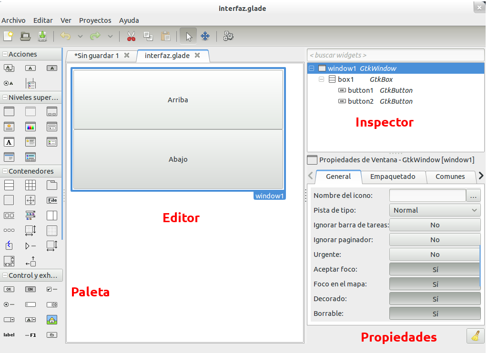
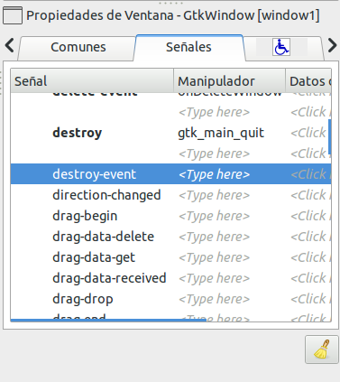
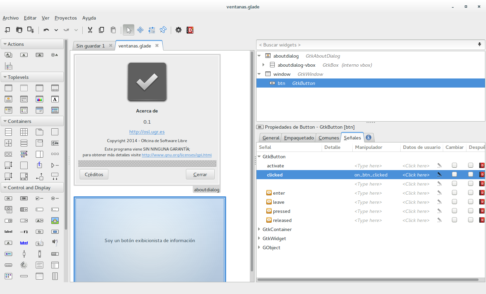
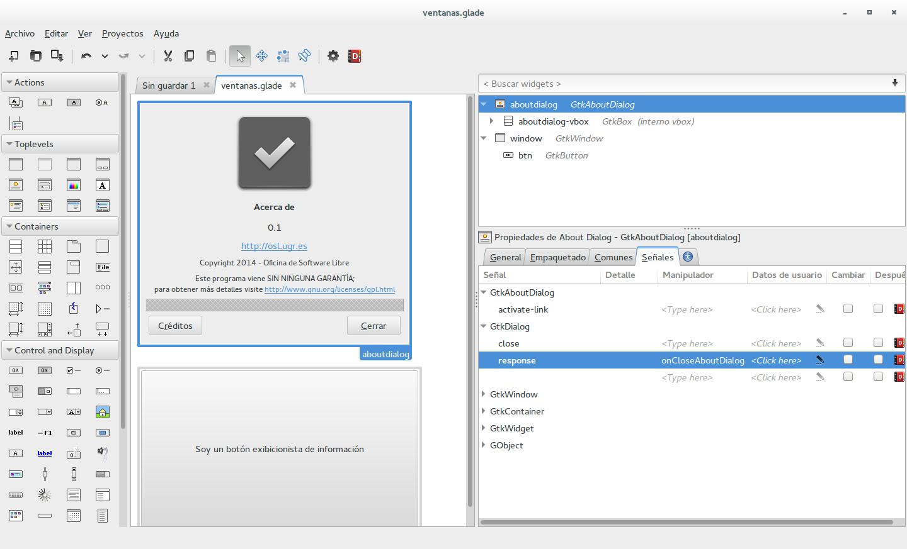
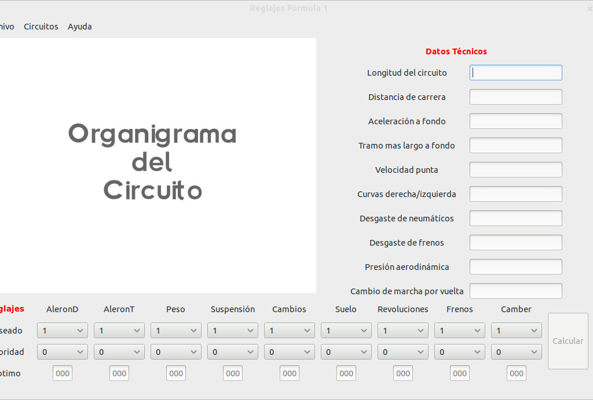

##Introdución
PyGTK es un conjunto de implementaciones de las librerías de la interfaz de usuario de GTK+ para el lenguaje de programación Python.

Python es un lenguaje de programación interpretado, ampliable y orientado a objetos que se distribuye con un amplio conjunto de módulos que permiten el acceso a un gran número de servicios del sistema operativo, servicios de internet (como HTML, XML, FTP, etc.), gráficos (incluidos OpenGL, TK, etc.), funciones de manejo de cadenas, servicios de correo (IMAP, SMTP, POP3, etc.), multimedia (audio, JPEG) y servicios de criptografía. Existen además multitud de módulos proporcionados por terceros que añaden otros servicios.

GTK (GIMP Toolkit) es una librería que permite crear interfaces gráficas de usuario. Se distribuye bajo la licencia LGPL, por lo que posibilita el desarrollo de software abierto, software libre, e incluso software comercial no libre que use GTK sin necesidad de pagar licencias o derechos.

Se le conoce como el toolkit de GIMP porque originalmente se escribió para desarrollar el Programa de Manipulación de Imágenes de GNU GIMP, pero GTK se usa ya en numerosos proyectos de software, incluído el proyecto de escritorio GNOME (Entorno de Modelo de Objetos orientados a Red). GTK+ está diseñada sobre GDK (Kit de Dibujo de GIMP) que, básicamente, es una abstracción de las funciones de bajo nivel que acceden al sistema de ventanas (Xlib en el caso del sistema de ventanas X).


GTK es fundamentalmente un interfaz orientada a objetos para programadores de aplicaciones (API). Aunque está escrita completamente en C, está implementada usando la idea de clases y funciones de retrollamada (punteros a función).

En el repositorio alojado en [Github](http://github.com/oslugr/curso-python-avanzado/tree/master/Interfaces_gr%C3%A1ficas_con_PyGTK) tenéis los códigos de ejemplo de este módulo del curso.

##Instalación

###Requisitos
Para la creación de un entorno de desarrollo decente en GNOME es necesario trabajar sobre una máquina con una distribución reciente. De esta manera evitaremos luchar con viejos problemas y dependencias. Para las siguientes instrucciones, se supone que se ha instalado Ubuntu 11.10 (o superior) en el equipo. Es muy aconsejable disponer de la versión 3.2 de GNOME, de esta manera también evitaremos problemas con dependencias.

###Herramientas de desarrollo
Mediante la línea de órdenes (o el Centro de Software de Ubuntu) instalaremos los paquetes necesarios para crear nuestras aplicaciones. Básicamente necesitaremos 3 herramientas:
- Tu IDE preferido o un simple editor de texto nos será mas que suficiente. Como buenos editores puedes usar [Geany](www.geany.org/), [Atom](https://atom.io/)
- [Glade](http://glade.gnome.org/), necesario para hacer el diseño de la interfaz. Versión recomendada 3.10
- [DevHelp](http://live.gnome.org/devhelp), documentación.

###Paquetes necesarios para Python
Python utiliza [GobjectIntrospection](http://live.gnome.org/GObjectIntrospection), por lo tanto simplemente tenemos de asegurarnos de tener un buen entorno de desarrollo para Python. Imprescindibles los paquetes python y python-object. Desde el intérprete de órdenes se instalarán fácilmente con apt-get (desde Ubuntu y derivados o con órdenes como yum, pacman etc si usamos otra distribución).

Para curarnos en salud y evitar errores por dependencias, instalaremos también el paquete gobject-introspection.

En definitiva:
```bash
sudo apt-get install python-gobject gobject-introspection
```

La instalación de librerías y paquetes has configurar nuestro entorno de desarrollo sea lo menos divertido en cuanto a la creación de aplicaciones con PyGTK. Una vez creado nuestro ¡Hola mundo! con PyGTK, el resto será coser y cantar.

##Arrancando motores
Tenemos dos vías principales de acceso al diseño de interfaces con PyGTK. La primera de estas vías se basa en un editor de texto, una buena documentación y muchas ganas de aprender. Comenzaremos por la vía del editor de texto.

Más adelante una vez que nos hayamos familiarizado con los widgets que tenemos a nuestro alcance, utilizaremos una aplicación que nos facilitará la creación de nuestra interfaz. Repetimos, esto será mas adelante.

Cómo no podía ser de otra manera, nuestro primer programa será el ¡Hola Mundo!. A continuación os mostraré el código fuente necesario para crear una ventana. Iremos comentando línea a línea para que sea más fácil de entender este ejemplo.
```python
#!/usr/bin/python
# -*- coding: utf-8 -*-
from gi.repository import Gtk

class MyWindow(Gtk.Window):
    
    def __init__(self):
        Gtk.Window.__init__(self, title="Hola Mundo!")

        self.button = Gtk.Button(label="Hazme click")
        self.button.connect("clicked", self.on_button_clicked)
        self.add(self.button)

    def on_button_clicked(self, widget):
        print("Hola Mundo!")

def main():
	win = MyWindow()
	win.connect("delete-event", Gtk.main_quit)
	win.show_all()
	Gtk.main()

main()
```

Bien, veamos que ocurre en este ejemplo. A partir de ahora usaremos L + número (o L+[rango]) para indicar el número de línea(s) correspondiente(s) al código del script sobre el que estemos trabajando. La estructura de este ejercicio se base en un clase llamada GUI (Interfaz gráfica de usuario) y una pequeña función “main” donde se creara una instancia de la clase GUI.

En el constructor de la clase GUI crearemos una ventana e incluiremos en ella un botón. Los métodos de la clase se asocian a las señales que se generan cuando la aplicación está en marcha. Se cierra la ventana, se pulsa un botón, etc …

Se puede observar en el código que al pulsar el botón se imprime el mensaje “Hola Mundo”. Cada señal lleva un bloque de código asociado donde se implementa la funcionalidad de cada objeto que está incluido en la ventana.

Veamos los comentarios específicos para cada línea:

- L2: Necesitamos importar el módulo Gtk para tener acceso a todos los objetos y funciones que nos proporciona GTK+

- L7: Se crea la ventana vacía.

- L[9-10]: Creamos un botón e indicamos que cuando se reciba la señal “clicked” se ejecute el método on_button_pressed.

- L11: Es necesario añadir el botón a la ventana para trabajar sobre el. Más adelante veremos widgets que hacen de contenedor de otros widgets. En este primer ejemplo simplemente lo añadimos a la ventana.

- L18: Conectamos la señal “destroy” a nuestro método destroy.

- L19: Método para mostrar la ventana y los objetos que contiene.

- L20: Inicia el bucle de procesamiento de GTK+. Finaliza cuando la ventana se cierra, línea 19.


Para probar nuestro primer programa, abrimos la terminal, nos posicionamos en el directorio que contiene el fichero y lanzamos la orden:
```bash
python 01_hola_mundo.py
```


##Bucle principal y señales
###Señales
Como la mayoría de herramientas para creación de interfaces de usuario, GTK+ utiliza un modelo de programación orientado a eventos. Cuando el usuario no está haciendo nada, GTK + ejecuta un bucle principal y espera la llegada de eventos. Si el usuario realiza alguna acción - por ejemplo, un clic del ratón - a continuación, el bucle principal "despierta" y envía un evento para GTK+.

Cuando un widget-objeto recibe un evento, lo que ocurre es que genera una o varias señales. Las señales se encargan de notificar a nuestra aplicación que algo interesante ha ocurrido. Esta señales están conectadas a funciones que se encargan de ejecutar bloques de código en función de la señal recibida.

A estas funciones se les llama comúnmente “callbacks”. Llamamos a estas funciones cuando queremos que ocurra alguna acción. Por ejemplo, cuando queremos que al hacer click sobre un botón se hagan una serie de cálculos y se muestre un resultado. Cuando finaliza esta función, regresamos al bucle principal a la espera de nuevos eventos.
Veamos un ejemplo básico.
id_conexion = widget.connect(“evento”, función_asociada, datos)

widget es una instancia de un objeto creado en nuestra aplicación. Mediante el método “connect” asociamos a esta instancia la señal “evento” con el bloque de código a ejecutar (cuando se reciba la señal) “función_asociada”. Por último, el parámetro datos se utiliza para pasar algunos datos cuando ocurre la señal. Este argumento es completamente opcional.

La función “connect” devuelve un identificador de la asociación entre evento y función asociada. Este identificador es necesario para desconectar el par evento-fución_asociada. En el caso de que no se utilice durante un perido concreto en la vida de la aplicación. La llamada sería:
widget.disconnect(id_conexion)

En la mayoría de las aplicaciones se debe conectar en la ventana principal el evento “delete-event”. Este evento se genera cuando se cierra la venta principal. El controlador (id) por defecto para esta señal, destruye la ventana, pero no termina la aplicación. La forma correcta de hacerlo es la siguiente:
window.connect(“delete-event”, Gtk.main_quit)

###Propiedades
Las propiedades nos indican la configuración y el estado de los widgets. Cada widget tiene su propio conjunto de propiedades concreto. Por ejemplo, un botón tiene la propiedad “label” que contiene el texto que se mostrará dentro del botón.

Las propiedades de cada widget se puede especificar cuando se crea una instancia del widget. Por decirlo de otra forma, llamando al constructor de la clase con los parámetros-propiedades que necesitemos para inicializar el widget. Veamos un ejemplo:

Etiqueta con el texto “Hola Mundo” alineado a la derecha con un ángulo de 25 grados.
mi_etiqueta = Gtk.Label(label=”Hola Mundo”, angle=25, haling=Gtk.Align.END)
lo cual es equivalente a:
mi_etiqueta = Gtk.Label() mi_etiqueta.set_label(“Hola Mundo”) mi_etiqueta.set_angle(25) mi_etiqueta.set_halign(Gtk.Align.END)

para recuperar el texto de la etiqueta o cualquier otra propiedad:
texto = mi_etiqueta.get_label() 

##WIDGETS
Cada pieza de una interfaz gráfica de usuario GTK+ se compone de uno o varios "widgets" que son objetos. Todos los widgets derivan de un widget de base llamado GtkWidget. Por ejemplo, una ventana de una aplicación es un widget llamado GtkWindow. La barra de herramientas dentro de la ventana es un widget llamado GtkToolbar.

Aunque un GtkWindow es también un GtkWidget, un GtkWidget no es necesariamente un GtkWindow. Los widgets hijos heredan de sus objetos padre para extender la funcionalidad del objeto. Se trata de programación orientada a objetos.

Podemos mirar en cualquier widget en la documentación de referencia de GTK + para ver qué objetos se derivan de el. En el caso de GtkWindow, se ve algo como esto:
```
+-- gobject.GObject
  +-- gtk.Object
    +-- gtk.Widget
      +-- gtk.Container
        +-- gtk.Bin
          +-- gtk.Window
```

Como puedes ver, un objeto GtkWindow hereda de un objeto GtkBin que se deriva de
GtkContainer, y así sucesivamente. La razón de que esta jerarquía sea tan importante es
porque cuando estas buscando funciones, propiedades o señales de cualquier widget, es necesario darse cuenta de que las funciones, propiedades o las señales de los objetos padre se aplican también a ese widget hijo.

También empezamos a ver que surge una convención de nombres. Esto es bastante útil. Todos los objetos que comienzan con Gtk pertenecen a la librería GTK+. Todos los objetos (y por lo tanto Widgets) distinguen entre mayúsculas y minúsculas.

Las funciones que manipulan estos objetos se identifican en minúsculas con guiones para espacios. Por ejemplo, gtk_window_set_title() es una función para establecer la propiedad de título de un objeto GtkWindow.

Dejamos un ejemplo simple de uso del widget ProgressBar (una barra de progreso para mostrar el completado de diferentes acciones) haciendo uso de lo ya mencionado en el tema del curso.
```python
#!/usr/bin/python
# -*- coding: utf-8 -*-

from gi.repository import Gtk, GObject

class ProgressBarWindow(Gtk.Window):

    def __init__(self):
        Gtk.Window.__init__(self, title="Demo del Widget ProgressBar")
        self.set_border_width(10)

        vbox = Gtk.Box(orientation=Gtk.Orientation.VERTICAL, spacing=6)
        self.add(vbox)

        self.progressbar = Gtk.ProgressBar()
        vbox.pack_start(self.progressbar, True, True, 0)

        button = Gtk.CheckButton("Mostrar completado")
        button.connect("toggled", self.on_show_text_toggled)
        vbox.pack_start(button, True, True, 0)

        button = Gtk.CheckButton("Modo activo")
        button.connect("toggled", self.on_activity_mode_toggled)
        vbox.pack_start(button, True, True, 0)

        button = Gtk.CheckButton("Completado inverso")
        button.connect("toggled", self.on_right_to_left_toggled)
        vbox.pack_start(button, True, True, 0)

        self.timeout_id = GObject.timeout_add(50, self.on_timeout, None)
        self.activity_mode = False

    def on_show_text_toggled(self, button):
        show_text = button.get_active()
        if show_text:
            text = "Auto Completado "+str(self.progressbar.get_fraction()*100)
        else:
            text = None
        self.progressbar.set_text(text)
        self.progressbar.set_show_text(show_text)

    def on_activity_mode_toggled(self, button):
        self.activity_mode = button.get_active()
        if self.activity_mode:
            self.progressbar.pulse()
        else:
            self.progressbar.set_fraction(0.0)

    def on_right_to_left_toggled(self, button):
        value = button.get_active()
        self.progressbar.set_inverted(value)

    def on_timeout(self, user_data):
        """
        Actualizamos el valor de la barra de progreso
        """
        if self.activity_mode:
            self.progressbar.pulse()
        else:
            new_value = self.progressbar.get_fraction() + 0.01

            if new_value > 1:
                new_value = 0

            self.progressbar.set_fraction(new_value)
            self.progressbar.set_text(str(self.progressbar.get_fraction()*100))

        # Como es una funcion timeout, devuelve True para asi 
        # continuar llamándose
        return True

win = ProgressBarWindow()
win.connect("delete-event", Gtk.main_quit)
win.show_all()
Gtk.main()
```

##GLADE
###Que es
Glade es un RAD (Desarrollo Rápido de Aplicaciones) para el diseño de aplicaciones con GTK+. Debemos decir que Glade es una aplicación GTK+ sí. Así como que es simplemente una pieza de software que los desarrolladores pueden utilizar para simplificar el proceso de diseño de la interfaz de una aplicación.

Esta aplicación nos genera el ```fichero.glade```. En realidad es un archivo XML que describe tanto la herencia como las propiedades de los widgets que componen la interfaz.

###Presentación de la interfaz
Veamos como esta estructurada la interfaz de Glade.

1. La Paleta.
En el lado izquierdo se encuentra. La paleta es semejante a la de una aplicación de edición gráfica. Se trata de una paleta de GtkWidgets que utilizaremos para diseñar nuestra aplicación.

2. El Editor.
En la zona media (que está vacía cuando se inicia por primera vez Glade). Aquí es donde se puede ver el diseño en curso. En el lado derecho observamos el "Inspector" en la parte superior y el widget de "Propiedades" por debajo de este.

3. El Inspector.
Muestra el diseño como un árbol que le permite acceder y ver la jerarquía de los widgets que componen el diseño. Podemos establecer las propiedades de widgets en las fichas de propiedades, incluyendo la especificación de las funciones de devolución de llamada para las señales.


###Estableciendo funciones a las señales en la ventana de propiedades
Los objetos emiten una "señal" cuando sucede algo que podría ser útil para el programador. Estas señales son similares a los "eventos" de Visual Basic. Como programador, debemos elegir las señales que deseamos capturar y llevar a cabo una tarea, además de conectar una función de devolución de llamada a esa señal.

La primera señal que vamos a aprender, y que vamos a utilizar en casi todas las aplicaciones GTK+ que diseñemos, es la señal "destroy" emitida por el widget GtkObject. Esta señal se emite cuando un GtkObject se destruye. Esto es importante, porque cuando el usuario cierra la ventana a través de 'x' que aparece arriba, en la barra de título o cualquier otro medio, por ejemplo, una entrada de menú, el widget se destruye.

Para capturar esta señal y salir de nuestra aplicación correctamente es necesario indicar la función que vamos a usar para atender a la señal. Se ilustra mejor cuando se escribe código para una GUI, sin embargo, por ahora, vamos a especificar la función que se va a llamar cuando la señal "destroy" se emite por nuestra GtkWindow.

En la ventana de propiedades desplegamos las señales GtkWidget. Localizamos la señal “destroy” y en la columna Manipulador, escribimos el nombre de la función que se va a llamar.



##GTK-BUILDER
El objeto Gtk.Builder nos permite diseñar una interfaz de usuario con una simple línea de código. EL funcionamiento de esta clase es muy simple. Se hace una descripción de la interfaz en un fichero XML, en tiempo de ejecución se carga el fichero XML y se crean los objetos automáticamente.

Aquí entra en juego Glade. Una vez diseñada la interfaz se creara el fichero con la descripción. El siguiente ejemplo muestra la estructura que crea Glade:
```xml
<?xml version="1.0" encoding="UTF-8"?>
<interface>
  <!-- interface-requires gtk+ 3.0 -->
  <object class="GtkWindow" id="window1">
    <property name="can_focus">False</property>
    <signal name="delete-event" handler="onDeleteWindow" swapped="no"/>
    <child>
      <object class="GtkBox" id="box1">
        <property name="visible">True</property>
        <property name="can_focus">False</property>
        <property name="orientation">vertical</property>
        <child>
          <object class="GtkButton" id="button1">
            <property name="label" translatable="yes">button1</property>
            <property name="visible">True</property>
            <property name="can_focus">False</property>
            <property name="receives_default">True</property>
            <signal name="pressed" handler="onButtonPressed" swapped="no"/>
          </object>
          <packing>
            <property name="expand">False</property>
            <property name="fill">True</property>
            <property name="position">0</property>
          </packing>
        </child>
        <child>
          <object class="GtkButton" id="button2">
            <property name="label" translatable="yes">button2</property>
            <property name="visible">True</property>
            <property name="can_focus">False</property>
            <property name="receives_default">True</property>
            <signal name="pressed" handler="onButtonClick" swapped="no"/>
          </object>
          <packing>
            <property name="expand">False</property>
            <property name="fill">True</property>
            <property name="position">1</property>
          </packing>
        </child>
      </object>
    </child>
  </object>
</interface>
```

Veamos que métodos de la clase nos permiten crear sobre la marcha nuestra interfaz:
```python
builder = Gtk.builder()
builder. add_from_file(“interfaz.glade”)
builder.add_objects_from_file(“interfaz.glade”, (“ventana1”,”boton1”, “boton2”))
```

Cuando ya hemos diseñado nuestra interfaz con glade y la hemos cargado con Gtk.builder es el momento de trabajar individualmente sobre cada widget/objeto.

Para poder visualizar nuestra ventana necesitamos acceder al nuestro objeto “ventana1” y llamar su método show_all:
```python
ventana = builder.get_object(“ventana1”)
ventana.show_all()
```

En caso de necesitarlo también disponemos de un método de Gtk.builder que nos permite recuperar una lista de todos los objetos disponibles:
```python
builder.get_objects()
```

Lo único que nos hace falta es conectar las señales que genera el usuario con los bloques de código correspondientes. En este caso el método es:
```python
builder.connet_signals(handlers)
```

La variable handlers es un diccionario, donde la clave es el identificador de la señal, y el valor es nombre de la función que será llamada cuando se reciba la señal.
```python
handlers = { “onDeleteWindow” : Gtk.main_quit,
    “onButtonPressed”: clickado,
}
```

Para hacer un tratamiento de señales más elegante definimos un clase Handler, cuyos métodos son llamados por las señales que genera el usuario.

Puedes ver un ejemplo en el siguiente bloque de código:
```python
#!/usr/bin/env python
# -*- coding: utf-8 -*-

from gi.repository import Gtk

class Handler:
    def __init__(self):
        self.__valor = True

    def onDeleteWindow(self, *args):
        Gtk.main_quit(*args)

    def onButtonPressed(self, button):
        print("Hello World!")
        
    def onButtonClick(self, button):
        if self.__valor:
            self.__btnLabel = button.get_label()
            button.set_label("Contenido nuevo")
            self.__valor = False
        else:
            self.__btnLabel = button.get_label()
            button.set_label("button2")
            self.__valor = True
        print self.__btnLabel
    valor = True
    btnLabel = ""

builder = Gtk.Builder()
builder.add_from_file("builder_example.glade")
builder.connect_signals(Handler())

window = builder.get_object("window1")
window.show_all()

Gtk.main()
```

##VENTANAS
En este apartado vamos a ver como crear un una ventana con los objetos GtkWindow y GtkAboutdialog.

Siguiendo los apartados anteriores, abriremos Glade y arrastraremos hasta el editor (o seleccionamos directamente para añadir) un objeto GtkWindow y un objeto GtkAboutDialog de la paleta de objetos.

Dentro de

Dentro del objeto GtkWindow vamos a añadir un objeto GtkButton, al que le vamos a asociar la función ```on_btn_clicked``` que mostrará el objeto GtkAboutDialog cuando se emita la señal “clicked”


Para cerrar la ventana que aparece al clikar sobre el botón, asignaremos una nueva función a la señal “response” que aparece en el conjunto de señales del objeto GtkAboutDialog.


Para que todo funcione solo nos falta escribir el bloque de código asociado a las señales. El código de este ejemplo está en:

[Github - Interfaces Gráficas PyGTK - Ventanas ](http://github.com/oslugr/curso-python-avanzado/tree/master/Interfaces_gr%C3%A1ficas_con_PyGTK/code/04_Ventanas)

##Menu y señales
Vamos a ver mediante una aplicación básica un ejemplo de como crear una barra de menú y asignarle bloques de código a las señales que generan las entradas de menú. 
<VIDEO>


##Botones, etiquetas y cajas de texto
Para acabar este módulo vamos a trabajar sobre una aplicación en la que aparecen múltiples etiquetas, cajas de texto y combobox.

Para completar este diseño tenemos que usar nuevos objetos que nos ayudan a distribuir colocar y alinear a los widgets que tienen dentro. A estos objetos les llamamos contenedores.

En esta aplicación se ha utilizado el objeto GtkBox para ubicar los widgets que componen la interfaz. La primera caja (GtkBox) tiene 3 filas, que corresponden a:

1. Barra de menú - GtkMenubar
2. Caja principal - GtkBox
3. Barra de estado – GtkStatusbar

La caja principal la dividimos horizontalmente en dos filas, la fila superior contiene a su vez un GtkBox de dos columnas. La columna de la izquierda contiene el widget para imágenes GtkImage. En la columna de la derecha aparecen los datos técnicos del circuito. En la fila inferior aparecen los objetos correspondientes a los reglajes.

Justo debajo de los datos técnico tenemos los objetos etiquetas y cajas de texto. Para alinearlos correctamente ya que son múltiples, nos decantaremos por un objeto GtkGrid en sustitución del GtkBox. Con el objeto GtkGrid le indicaremos el número de filas y columnas que necesitamos. En cada una de sus celdas colocaremos los widgets GtkLabel y GtkEntry.

La primera funcionalidad de la aplicación consiste en recuperar de una base de datos los datos que corresponden a cada circuito. El usuario seleccionará del menú circuitos una entrada cualquiera (menuitem) que genera una señal que llamará a la función “onCircuitActivate”

```onCircuitActivate``` realiza varias acciones:
- Establece la imagen del circuito.
- Recupera de la base de datos la información del - circuito
- Esa información se carga en las cajas de texto
- Se ponen a cero las cajas que aparecen en la última fila de la zona de reglajes
- Activar el botón Calcular.

Puedes ver el código de esta función en:
```python
def onCircuitActivate(self, menuitem):
                
        self.circuito = menuitem.get_label()
        image = self.builder.get_object("image1")
        image.set_from_file(self.get_image(self.circuito))
                
        entry1 = self.builder.get_object("entry1")
        entry2 = self.builder.get_object("entry2")
        entry3 = self.builder.get_object("entry3")
        entry4 = self.builder.get_object("entry4")
        entry5 = self.builder.get_object("entry5")
        entry6 = self.builder.get_object("entry6")
        entry7 = self.builder.get_object("entry7")
        entry8 = self.builder.get_object("entry8")
        entry9 = self.builder.get_object("entry9")
        entry10 = self.builder.get_object("entry10")
        
                
        datos = self.get_datos(self.circuito)
        
        entry1.set_text(datos['d1'])
        entry2.set_text(datos['d2'])
        entry3.set_text(datos['d3'])
        entry4.set_text(datos['d4'])
        entry5.set_text(datos['d5'])
        entry6.set_text(datos['d6'])
        entry7.set_text(datos['d7'])
        entry8.set_text(datos['d8'])
        entry9.set_text(datos['d9'])
        entry10.set_text(datos['d10'])
        
        datos ={'d1': str("000"),
                 'd2': str("000"),
                 'd3': str("000"),
                 'd4': str("000"),
                 'd5': str("000"),
                 'd6': str("000"),
                 'd7': str("000"),
                 'd8': str("000"),
                 'd9': str("000"),}
        
        self.populate_entry_optimo(datos)
        
        button1 = self.builder.get_object("button1")
        button1.set_sensitive(True)
        
        return True
```

El diseño y el código de esta aplicación esta disponible en el siguiente repositorio. Como practica se recomienda dedicarle un tiempo a ver cada bloque de código para ver la dinámica de funcionamiento entre interfaz, objetos y señales.
[ReglajesF1](https://github.com/oslugr/curso-python-avanzado/blob/master/Interfaces_gráficas_con_PyGTK/code/05_Reglajes)

##Notas
Es posible que al lanzar las aplicaciones os de un error como:
```bash
WARNING **: Couldn't register with accessibility bus: Did not receive a reply. Possible causes include: the remote application did not send a reply, the message bus security policy blocked the reply, the reply timeout expired, or the network connection was broken.
```

Por mala suerte es un [bug](https://bugs.launchpad.net/ubuntu/+source/apport/+bug/1222356) que aún no está resuelto.

